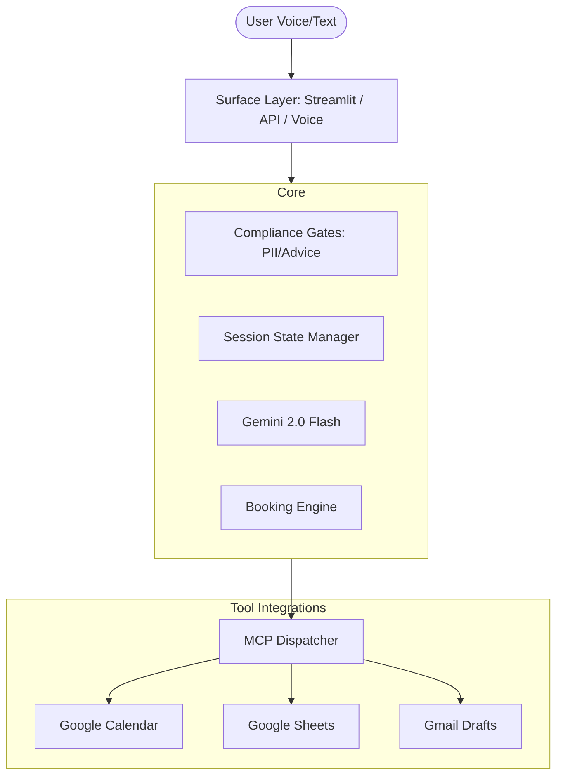

# Advisor Appointment Scheduler — Voice Agent

A compliant, professional, and intelligent voice assistant designed to help users quickly secure tentative appointments with human advisors. Built with modern AI (Gemini, Sarvam AI) and Model Context Protocol (MCP) tool integrations.


## 🌟 Overview

The **Advisor Appointment Scheduler** is a high-performance voice agent that streamlines the pre-booking process. It handles user intent, enforces strict compliance (PII filtering and disclaimers), and orchestrates real-world side effects through Google Workspace integrations.

### Key Highlights:
- **Zero PII on Call**: No personal data (phone, email, account numbers) is collected during the voice interaction.
- **MCP-Powered**: Automatically creates calendar holds, updates logs in Google Sheets, and drafts emails in Gmail.
- **Multilingual Support**: Designed for high-performance interaction in multiple Indian languages.
- **State-Driven**: Uses a robust Finite State Machine (FSM) to ensure consistent user flows.

---

## 🚀 Features

### 1. Intelligent Intent Handling
The agent accurately classifies and manages 5 key core intents:
- `book_new`: Initiates a new booking.
- `reschedule`: Modifies an existing tentative slot.
- `cancel`: Cancels a pending hold.
- `what_to_prepare`: Educates users on required documentation.
- `check_availability`: Lists free slots for a specific day.

### 2. Compliance & Safety
- **Disclaimer Gate**: Automatically delivers regulatory disclaimers before proceeding.
- **PII Filter**: Real-time regex and LLM-based filtering to ignore sensitive user data.
- **Advice Refusal**: Strictly refuses to provide investment advice, redirecting to educational resources.

### 3. Google Workspace Integration (via MCP)
- **Calendar**: Creates "Tentative Hold" events with unique booking codes.
- **Notes**: Appends booking logs to a centralized Google Spreadsheet.
- **Email**: Prepares approval-gated drafts for advisors to review.

---

## 🏗️ Architecture

The system follows a **"Chat First, Voice Second"** philosophy, where business logic is strictly decoupled from the I/O layer.



---

## 🛠️ Tech Stack

- **Large Language Model**: [Google Gemini 2.0 Flash](https://ai.google.dev/)
- **Voice Pipeline**: 
  - **STT/TTS**: [Sarvam AI](https://www.sarvam.ai/) / [Edge-TTS](https://github.com/rany2/edge-tts)
  - **VAD**: Silero Voice Activity Detection
- **Frameworks**: 
  - **Core**: Python 3.10+
  - **Frontend**: Streamlit (Chat UI), Gradio (Voice UI)
  - **Backend**: FastAPI (Phase 5)
- **APIs**: Google Workspace APIs (via `google-api-python-client`)

---

## 📥 Installation

1. **Clone the repository**:
   ```bash
   git clone https://github.com/your-repo/voice-agent.git
   cd voice-agent
   ```

2. **Set up a virtual environment**:
   ```bash
   python -m venv venv
   source venv/bin/activate  # Windows: venv\Scripts\activate
   ```

3. **Install dependencies**:
   ```bash
   pip install -r requirements.txt
   ```

4. **Configure Environment Variables**:
   Create a `.env` file (or set Streamlit secrets):
   ```env
   GOOGLE_API_KEY=your_gemini_key
   SARVAM_API_KEY=your_sarvam_key
   GOOGLE_CREDENTIALS_JSON=...
   GOOGLE_TOKEN_JSON=...
   ```

---

## 🏃 Running the Application

### Streamlit Chat App (Current Interface)
```bash
streamlit run app.py
```

### Voice Interface (Experimental)
```bash
python run_voice.py
```

### Testing the Core Logic
```bash
pytest tests/
```

---

## 📅 Roadmap: Phase-wise Development

- [x] **Phase 1**: Scaffold + Session FSM (Chat Only)
- [x] **Phase 2**: LLM Integration + Intent/Topic Resolution
- [x] **Phase 3**: Booking Engine + Mock Calendar
- [x] **Phase 4**: MCP Tool Integration (Google Workspace)
- [ ] **Phase 5**: REST API Surface (FastAPI)
- [ ] **Phase 6**: Final Voice Adapter (STT/TTS Optimization)

---

## 📄 License
This project is for demonstration and milestone testing of AI voice systems. See the internal documentation for compliance and IP details.
