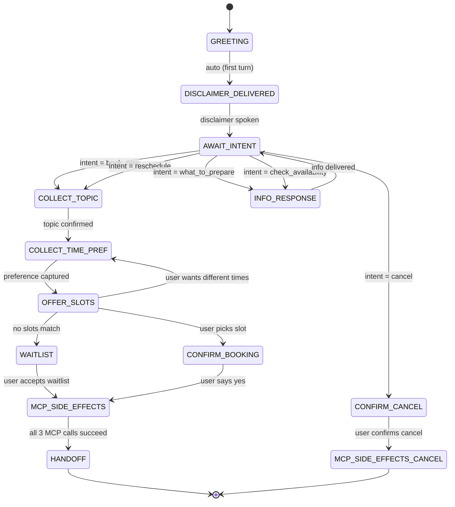

# Architecture: Advisor Appointment Scheduler — Voice Agent
## Development Strategy: Chat First, Voice Second

> **Principle:** Every feature is built and validated as text-in / text-out first.
> Voice is a thin I/O adapter added last. Zero business logic lives in the voice layer.

---

## 1. High-Level System Diagram

```
┌─────────────────────────────────────────────────────────────────────┐
│                        SURFACE LAYER (swappable)                    │
│                                                                     │
│   ┌──────────────┐    ┌──────────────┐    ┌──────────────────────┐  │
│   │  Chat UI /   │    │  REST API    │    │  Voice Adapter       │  │
│   │  CLI         │    │  POST /msg   │    │  (STT → core → TTS) │  │
│   └──────┬───────┘    └──────┬───────┘    └──────────┬───────────┘  │
│          │                   │                       │              │
│          └───────────┬───────┘───────────────────────┘              │
│                      ▼                                              │
│         ┌────────────────────────┐                                  │
│         │  handle(user_text,     │  ◄── single entry point          │
│         │         session)       │                                  │
│         └────────────┬───────────┘                                  │
└──────────────────────┼──────────────────────────────────────────────┘
                       ▼
┌──────────────────────────────────────────────────────────────────────┐
│                         CORE LAYER (transport-agnostic)              │
│                                                                      │
│  ┌───────────┐  ┌────────────┐  ┌────────────┐  ┌───────────────┐   │
│  │ Compliance │  │   Intent   │  │  Booking   │  │  Session /    │   │
│  │   Gates    │  │  Router +  │  │  Engine    │  │  State Mgr    │   │
│  │ (PII, Dis- │  │  Topic     │  │ (Slots,    │  │ (FSM +        │   │
│  │  claimer)  │  │  Resolver  │  │  Codes,    │  │  Turn Memory) │   │
│  └─────┬─────┘  └─────┬──────┘  │  Waitlist) │  └───────┬───────┘   │
│        │               │        └─────┬──────┘          │           │
│        └───────┬───────┘──────────────┘─────────────────┘           │
│                ▼                                                     │
│  ┌──────────────────────────────────────────────────────────────┐    │
│  │                    MCP TOOL DISPATCHER                       │    │
│  │  ┌────────────┐   ┌────────────┐   ┌──────────────────┐     │    │
│  │  │  Calendar   │   │   Notes    │   │  Email (approval │     │    │
│  │  │  Hold       │   │   Append   │   │   gated draft)   │     │    │
│  │  └────────────┘   └────────────┘   └──────────────────┘     │    │
│  └──────────────────────────────────────────────────────────────┘    │
└──────────────────────────────────────────────────────────────────────┘
```

---

## 2. Core Layer — Detailed Design

### 2.1 Entry Point: `handle(user_text: str, session: Session) → list[str]`

This is the **only** function any surface calls. It returns one or more assistant messages (as plain strings). The chat UI displays them; the voice adapter feeds them to TTS.

```
def handle(user_text: str, session: Session) -> list[str]:
    # 1. Compliance gate — reject PII, enforce disclaimer
    # 2. Route to intent handler based on session.state + NLU
    # 3. Intent handler mutates session, may call MCP tools
    # 4. Return assistant response strings
```

### 2.2 Session / State Manager (Finite State Machine)

Each conversation is a session object holding:

| Field              | Type                   | Purpose                                      |
|--------------------|------------------------|----------------------------------------------|
| `session_id`       | `str (UUID)`           | Unique conversation identifier               |
| `state`            | `Enum (State)`         | Current FSM node (see below)                 |
| `topic`            | `Optional[TopicEnum]`  | Selected consultation topic                  |
| `day_preference`   | `Optional[str]`        | User's requested day                         |
| `time_preference`  | `Optional[str]`        | User's requested time                        |
| `offered_slots`    | `list[Slot]`           | The two slots presented to user              |
| `chosen_slot`      | `Optional[Slot]`       | The slot user confirmed                      |
| `booking_code`     | `Optional[str]`        | Generated code e.g. "NL-A742"               |
| `disclaimer_given` | `bool`                 | Whether disclaimer has been spoken            |
| `turn_history`     | `list[Turn]`           | Conversation log (text only, no PII stored)  |

**FSM States & Transitions:**



### 2.3 Intent Router + Topic Resolver

**Intent Detection** — Uses LLM function-calling or structured output to classify user text into exactly one of 5 intents:

| Intent                | Trigger Examples                                    |
|-----------------------|-----------------------------------------------------|
| `book_new`            | "I'd like to book a slot", "schedule an appointment"|
| `reschedule`          | "Can I change my time?", "move my booking"          |
| `cancel`              | "Cancel my appointment", "I don't need it anymore"  |
| `what_to_prepare`     | "What should I bring?", "How do I prepare?"         |
| `check_availability`  | "What times are free?", "Any slots on Monday?"      |

**Topic Resolver** — Constrains to exactly 5 allowed topics (LLM structured output with enum):

```
class TopicEnum(str, Enum):
    KYC_ONBOARDING        = "KYC/Onboarding"
    SIP_MANDATES           = "SIP/Mandates"
    STATEMENTS_TAX_DOCS    = "Statements/Tax Docs"
    WITHDRAWALS_TIMELINES  = "Withdrawals & Timelines"
    ACCOUNT_CHANGES_NOMINEE = "Account Changes/Nominee"
```

If the user asks about anything outside these topics (e.g., stock tips), the agent refuses investment advice and provides an educational link.

### 2.4 Compliance Gates

These run **before** any intent handling on every turn:

| Gate                | Logic                                                                                       |
|---------------------|---------------------------------------------------------------------------------------------|
| **Disclaimer Gate** | If `session.disclaimer_given == False`, prepend the disclaimer to the first response.        |
| **PII Filter**      | Regex scan for patterns: phone numbers (`\d{10}`), emails (`\S+@\S+`), Aadhaar-like numbers, PAN format. If detected → discard from context, respond with: *"Please don't share personal details on this call. I only need your topic and preferred time."* |
| **Advice Refusal**  | If LLM detects investment-advice-seeking intent → refuse and offer educational URL.          |

### 2.5 Booking Engine

#### 2.5.1 Slot Resolution

```
def resolve_slots(day: str, time_pref: str) -> list[Slot]:
    """
    Queries the mock calendar for the requested day.
    Returns max 2 available Slot objects.
    Each Slot: { datetime (IST), duration_min: 30, advisor_id }
    If 0 slots found → return empty list (triggers waitlist path).
    """
```

Mock calendar is a simple in-memory dict of available half-hour blocks per day. This will later be replaced by a real Google Calendar API call via MCP.

#### 2.5.2 Booking Code Generator

```
def generate_booking_code() -> str:
    """
    Format: 'XX-YZZZ'
    XX  = 2 random uppercase letters
    Y   = 1 random uppercase letter
    ZZZ = 3 random digits
    Example: 'NL-A742'

    Optimized for TTS readability:
    Agent will read as 'N-L dash A-7-4-2'
    """
```

#### 2.5.3 Confirmation Response Builder

When the user confirms a slot, the engine produces a structured confirmation string that **always** includes:

1. The **topic** name
2. The **full date and time** repeated explicitly
3. The **timezone (IST)** stated
4. The **booking code**

Example: *"Confirmed. Your tentative appointment for KYC/Onboarding is on Monday, 14 April 2026 at 3:00 PM IST. Your booking code is NL-A742."*

#### 2.5.4 Waitlist Path

If `resolve_slots()` returns empty:
- Inform user no slots match their preference
- Offer to place them on a waitlist
- If accepted → create a waitlist hold via MCP Calendar, append to notes, draft email with `waitlist: true` flag

---

## 3. MCP Tool Integration

All three MCP tools are called **only** after the user confirms (state = `MCP_SIDE_EFFECTS`). They are called sequentially — if any fails, the agent informs the user and retries or provides a fallback reference number.

### 3.1 MCP Calendar: `create_tentative_hold`

```
Input:
  topic:    TopicEnum
  code:     str           # "NL-A742"
  slot:     Slot          # { datetime, duration_min }
  waitlist: bool

Action:
  Creates a calendar event titled:
    "Advisor Q&A — {topic} — {code}"
  Status: TENTATIVE
  Duration: 30 minutes

Output:
  calendar_event_id: str
```

### 3.2 MCP Notes: `append_booking_note`

```
Input:
  date:     str           # ISO date of booking
  topic:    TopicEnum
  slot:     str           # formatted slot time
  code:     str           # booking code
  waitlist: bool

Action:
  Appends a row to the "Advisor Pre-Bookings" document/table:
  | Date       | Topic              | Slot          | Code    | Status   |
  |------------|--------------------|---------------|---------|----------|
  | 2026-04-14 | KYC/Onboarding     | 3:00 PM IST   | NL-A742 | Tentative|

Output:
  note_entry_id: str
```

### 3.3 MCP Email: `draft_advisor_email`

```
Input:
  topic:          TopicEnum
  code:           str
  slot:           str
  waitlist:       bool
  approval_gated: true    # ALWAYS true — email sits in draft/outbox

Action:
  Creates an email draft (NOT sent) to the advisor:
    Subject: "[Pre-Booking] {topic} — {code} — {slot}"
    Body:    Structured summary of the tentative booking.
    Flag:    Requires manual advisor approval before sending.

Output:
  draft_id: str
```

---

## 4. Handoff — Final Agent Response

After all 3 MCP tools succeed, the agent delivers the final message:

```
"Your tentative appointment for {topic} is booked for {day}, {date} at {time} IST.
Your booking code is {code}.
Please visit {secure_url} and enter your booking code within 2 hours
to provide your contact details and finalize the appointment.
Thank you — goodbye."
```

**No PII is collected on the call.** The secure URL is where the user completes their details offline.

---

## 5. Phase-Wise Implementation Milestones

### Phase 1 — Scaffold + Session FSM (Chat Only)
| Item | Detail |
|------|--------|
| **Build** | Python project structure: `core/`, `surfaces/chat/`, `mcp/`, `tests/` |
| **Implement** | `Session` dataclass, `State` enum, FSM transition logic |
| **Implement** | `handle()` entry point with hardcoded responses per state |
| **Implement** | In-memory session store (dict of session_id → Session) |
| **Surface** | CLI chat loop: `while True: user = input(); print(handle(user, session))` |
| **Test** | Walk through GREETING → DISCLAIMER → AWAIT_INTENT manually via CLI |
| **Deliverable** | A running CLI chatbot that moves through states with stub responses |

### Phase 2 — LLM Integration + Intent/Topic Resolution
| Item | Detail |
|------|--------|
| **Implement** | LLM client (Gemini / OpenAI) with system prompt defining persona + constraints |
| **Implement** | Intent classifier using LLM structured output (function calling / JSON mode) |
| **Implement** | Topic resolver with `TopicEnum` validation |
| **Implement** | Compliance gates: disclaimer auto-prepend, PII regex filter, advice refusal |
| **Implement** | Conversational prompts for each state (topic clarification, time collection) |
| **Test** | Automated test suite: send 20+ scripted user messages, assert correct state transitions and intent classifications |
| **Deliverable** | Chat agent that correctly classifies intents, collects topic + time, and refuses PII/advice |

### Phase 3 — Booking Engine + Mock Calendar
| Item | Detail |
|------|--------|
| **Implement** | Mock calendar: in-memory availability data for the next 7 days |
| **Implement** | `resolve_slots()` — returns 2 matching slots or empty list |
| **Implement** | `generate_booking_code()` — produces "XX-YZZZ" codes |
| **Implement** | Confirmation response builder with IST timezone formatting |
| **Implement** | Waitlist path: offer waitlist → store waitlist hold |
| **Test** | Test slot matching with various day/time inputs, test waitlist trigger, test code uniqueness |
| **Deliverable** | Chat agent that offers real slots, generates codes, handles waitlist — all via text |

### Phase 4 — MCP Tool Integration
| Item | Detail |
|------|--------|
| **Implement** | MCP Calendar server (or mock): `create_tentative_hold()` |
| **Implement** | MCP Notes server (or mock): `append_booking_note()` |
| **Implement** | MCP Email server (or mock): `draft_advisor_email()` with `approval_gated: true` |
| **Implement** | MCP dispatcher in core: calls all 3 tools sequentially on confirmation |
| **Implement** | Error handling: if MCP call fails → retry once → inform user with fallback code |
| **Test** | End-to-end test: full booking flow from greeting → handoff, verify all 3 MCP side effects |
| **Deliverable** | Complete chat agent with working MCP integrations; all 5 intents functional |

### Phase 5 — REST API Surface
| Item | Detail |
|------|--------|
| **Implement** | FastAPI app with `POST /message` endpoint: `{ session_id, text }` → `{ messages[] }` |
| **Implement** | `POST /session` to create new sessions, `GET /session/{id}` for state inspection |
| **Implement** | Session persistence (Redis or SQLite) replacing in-memory dict |
| **Test** | Postman / curl tests for all flows; load test with concurrent sessions |
| **Deliverable** | Production-ready API that any frontend can call |

### Phase 6 — Voice Adapter (Final Layer)
| Item | Detail |
|------|--------|
| **Implement** | STT integration (Sarvam AI / Deepgram / Whisper) → produces `user_text` |
| **Implement** | TTS integration (Sarvam AI / ElevenLabs) → reads `assistant_text` aloud |
| **Implement** | VAD (Silero) for turn detection + barge-in handling |
| **Implement** | Voice-specific UX: spell booking code character-by-character, repeat date/time |
| **Implement** | WebRTC or telephony transport (LiveKit / Twilio) |
| **Wire** | `STT output → handle(user_text, session) → TTS input` — no new business logic |
| **Test** | End-to-end voice test: call the agent, complete a full booking |
| **Deliverable** | Fully functional voice agent — same core, new I/O surface |

---

## 6. Project Structure

```
voice-agent/
├── core/
│   ├── __init__.py
│   ├── handler.py          # handle(user_text, session) → list[str]
│   ├── session.py          # Session dataclass, State enum, FSM transitions
│   ├── intents.py          # Intent classification (LLM structured output)
│   ├── topics.py           # TopicEnum, topic resolver
│   ├── compliance.py       # PII filter, disclaimer gate, advice refusal
│   ├── booking.py          # Slot resolution, code generation, confirmation builder
│   └── prompts.py          # All LLM system/user prompt templates
├── mcp/
│   ├── __init__.py
│   ├── dispatcher.py       # Orchestrates all 3 MCP calls
│   ├── calendar_tool.py    # create_tentative_hold()
│   ├── notes_tool.py       # append_booking_note()
│   └── email_tool.py       # draft_advisor_email()
├── surfaces/
│   ├── chat/
│   │   └── cli.py          # CLI chat loop (Phase 1)
│   ├── api/
│   │   └── server.py       # FastAPI REST API (Phase 5)
│   └── voice/
│       ├── adapter.py      # STT → handle() → TTS wiring (Phase 6)
│       ├── vad.py          # Voice activity detection
│       └── tts_utils.py    # Booking code spelling, pace control
├── tests/
│   ├── test_intents.py
│   ├── test_booking.py
│   ├── test_compliance.py
│   ├── test_mcp.py
│   └── test_e2e_flow.py
├── config.py               # API keys, model selection, timezone (IST)
├── requirements.txt
└── README.md
```

---

## 7. Key Design Decisions

| Decision | Rationale |
|----------|-----------|
| **`handle()` returns `list[str]`** not a single string | Some turns need multiple messages (e.g., disclaimer + greeting + prompt). Chat displays them sequentially; TTS reads them with pauses. |
| **FSM in code, not in the LLM** | The LLM generates natural language within a state; the FSM controls which state we're in. This prevents the LLM from skipping steps or hallucinating flows. |
| **MCP calls are sequential, not parallel** | Calendar must succeed before notes reference the event ID. Email references both. Ordered execution with retry. |
| **Mock calendar first, real API later** | Unblocks Phases 1–4 without external dependencies. Swap mock → real behind the same interface. |
| **PII filter is regex + LLM instruction** | Defense in depth. Regex catches obvious patterns (phone, email). LLM instruction prevents the agent from *asking* for PII. |
| **Voice adapter adds zero business logic** | If a bug exists in booking flow, it's always in `core/`. Voice team never touches domain code. |
